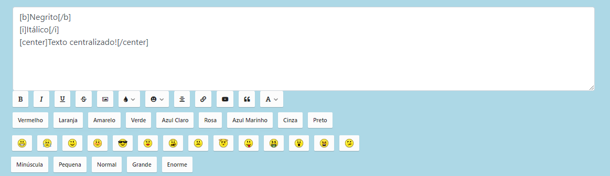

# BBCode Editor



 Um simples modelo do famoso editor de textos dinâmico.
 
# Necessários:

> jquery

# Como utilizar?

_Primeiro passo_

> Mover o arquivo do diretório **class/Functions.class.php** para dentro da sua pasta de classes.

> Copiar o conteúdo do arquivo **js/bbcode.js** e colar no seu javascript default.

> Copiar o conteúdo do arquivo **css/bbcode.css** e colar no seu arquivo de estilos.

_Segundo passo_

Para inserir o editor à um textarea, basta colocar um id no mesmo, e adicionar esta div após:

```
<div class="bbcode"><?php echo $Functions->BBCode('#ID-DO-TEXTAREA', PADRÃO = 1) ?></div>
```

# IMPORTANTE

O editor tem dois padrões de edição: **1 e 2**.

Sendo:

### 1:

- Negrito,
- Itálico,
- Underline,
- Escrita tachada,
- Cores,
- Emoticons.

### 2: 

inclui os itens do padrão 1, adicionando:

- Imagens,
- Centralizar texto,
- Inserir URLs,
- Inserir vídeos,
- Blockquote,
- Tamanho de letras.
